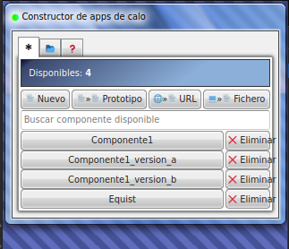
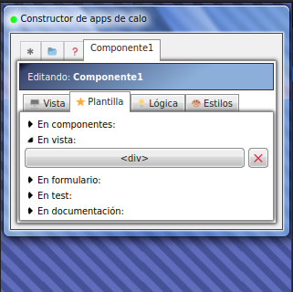
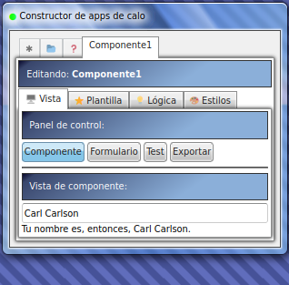
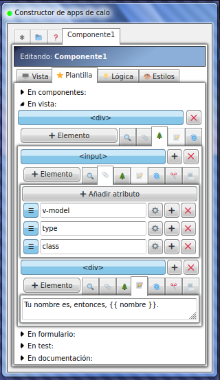
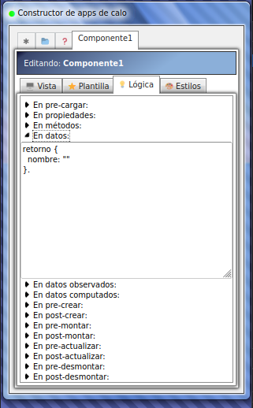

# Constructor de apps de Castelog

Construcción de apps tipo web con Castelog.

## Instalación

**Paso 1**. Abre un directorio limpio, clona este proyecto e instala las dependencias.

```sh
mkdir directorio-limpio
cd directorio-limpio
git clone https://github.com/allnulled/constructor-de-apps-de-castelog.git .
npm install
```

**Paso 2**. Arranca el servidor de test que nos sirve la aplicación de *Constructor de apps de calo*.

```sh
npm test
```

Para desarrollo, puedes editar los ficheros *.calo* y generar sus *.html* o *.js* automáticamente.

## ¿Para qué sirve?

El «Constructor-de-apps-de-calo» es:
  - una interfaz web de usuario
  - destinada a crear interfaces web de usuario
  - por componentes reusables
  - mediante (80%) interacción gráfica + (20%) scripting
  - usando el lenguaje Calo

Una web para crear webs usando componentes. Una cosa similar al viejo Dreamweaver. Pero con Calo. Y más tirado, claro.

## ¿Por qué si ya existen tropocientas?

Porque nunca dan lo obvio que se necesita, no me digas por qué. Son buenísimos. Pero te dan una cosa que se acerca. Pero no la cosa obvia. Yo entiendo que es una estrategia existencial, para hacerlo entretenido.

## Uso

Tienes la documentación de los proyectos de JavaScript implicados en la sección de documentación, embedida en la interfaz de usuario, para que no tengas que estar consultando siempre sobre cosas propias de las herramientas de Calo.

Los lenguajes html, css y js están esbozados con cheat sheets que he visto destacables, pero también tienes los links a las documentaciones oficiales de Mozilla típicamente.

## Imágenes

El programa en funcionamiento se ve tal que así:

**La sección de todos los componentes.** Aquí puedes buscar componentes, crear por varios métodos (en blanco, por prototipo, por URL, por fichero JSON) nuevos componentes, eliminarlos o abrirlos para su edición.



**La sección de edición de componente**. En esta sección encontrarás paneles relacionados con la gestión del componente: *la vista* para ver el componente en acción, *la plantilla* para definir varios aspectos de la interfaz, *la lógica* para definir la lógica propia del componente, o *los estilos* para añadirle reglas css vinculadas al componente.



**La sección de vista**. En esta sección puedes visualizar y usar el componente definido entre las otras pestañas concomitantes: plantilla, lógica y estilos. También puedes visualizar la plantilla del formulario, ejecutar los tests del componente en vivo, o exportar/descargar el componente como fichero `*.calo-componentes.json`.



**La sección de plantilla**. Aquí se puede editar la plantilla del componente mediante interfaz o mediante código directo. Se trata de componer un árbol del DOM propio del HTML, pero con las capacidades extra de la plantillas de Vue2.js. Además, los atributos permiten inyectar calo directamente, por lo cual no lidiaremos con JavaScript en ningún momento.



**La sección de lógica**. En esta sección podemos intervenir en los campos propios de un componente Vue2.js: los métodos del ciclo de vida de los componentes de Vue2.js, el métodos data, o los objetos de propiedades, observadores (`watch`), computadores (`computed`), etc. De este modo, somos libres de aplicar la lógica en la forma que queramos, definir los parámetros cómo queramos, e irrumpir en cualquier parte ciclo de vida que recorrerá nuestro componente.



Sin olvidar de todas las mejoras incorporadas en Calo, que te van a permitir usar todas las APIs incluidas.

## Licencia

Legal y regalada debería ser, para todo el que la quiera. Malditos.